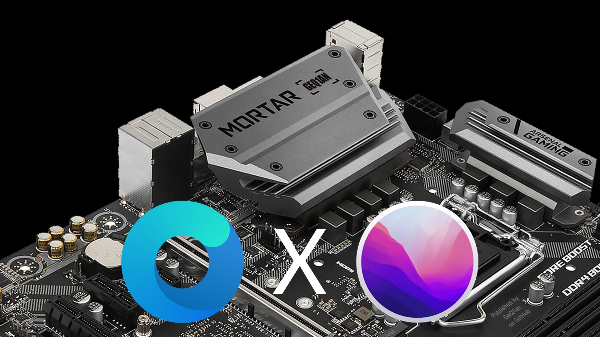

# MSI B360M MORTAR (TITANIUM) Hackintosh OpenCore EFI

[](https://github.com/acidanthera/OpenCorePkg/releases/latest)
[](https://www.apple.com/macos/ventura/)
[](https://www.apple.com/macos/sonoma-preview/)
[](https://github.com/GeQ1an/MSI-B360M-MORTAR-HACKINTOSH-OPENCORE-EFI/commits/master/)
[](https://github.com/GeQ1an/MSI-B360M-MORTAR-HACKINTOSH-OPENCORE-EFI/blob/master/LICENSE)
[](https://t.me/usestick/)

Actually, my English is not fantastic. But I will try my best to translate, some content from Google Translate. 需要简体中文? [点此查看](https://github.com/GeQ1an/MSI-B360M-MORTAR-HACKINTOSH-OPENCORE-EFI/blob/master/README.md)。

## Important
Unknowingly, this project has been updated for more than 3 years, but with the release of the Mac Pro equipped with Apple Silicon, all Mac products have stopped using the x86 platform. Sonoma may be the last macOS that supports the x86 platform, and I also used it at home before. The computer is replaced by Mac Studio, so this project will stop updating within one month after Sonoma releases the official version. Thank you for your use.

## About



This EFI uses `iMac19,1` SMBIOS. Most users of MSI B360M MORTAR (includes TITANIUM version) can use it through modification. The integrated graphics and discrete graphics participate in hardware decoding. By default, all USB ports are injected. OpenCore version: 0.9.3. The highest supported system is macOS Sonoma 14 beta.

> Please note: This EFI is only a personal build sharing, and is marked with simple tips. It is not a standard OpenCore Hackintosh installation guide. If you need a standard installation guide, please jump to [Dortania's Getting Started](https://dortania.github.io/getting-started/). You may encounter some problems when starting Hackintosh after installing or updating hardware for the first time. Although most of the problems can be solved, there are actually some problems that cannot be solved. It can even be said that there is a certain element of luck in it. If you want to Applying this EFI recommends using hardware close to mine in order to have the same experience as possible.

#### About Hackintosh


### Working
- [x] Sound Card (Onboard) / Network Card (Onboard)
- [x] Graphics Card (Integrated + Discrete) / Hardware Decoding 4K (HEVC + H.264)
- [x] WiFi (PCI-E devices) / Bluetooth (USB device over PCI-E)
- [x] AirDrop / Handoff / Sidecar
- [x] FaceTime / iMessage
- [x] Apple Music / Apple TV Plus
- [x] XCPM (XNU's CPU Power Management) / HWP
- [x] Sleep / Wake from Keyboard and Mouse
- [x] Other Mac features (99% completed)

### Hardware List

|          Specs | Details                                                   | 
|---------------:|:----------------------------------------------------------|
|          Board | MSI® B360M MORTAR                                         |
|            CPU | Intel® Core™ i5-9600K (with Intel UHD Graphics 630)       |
|         Memory | GLOWAY® Brave Warrior 8GB DDR4 2666MHz x 2                |
|            SSD | Western Digital® WD_BLACK™ SN750 NVMe™ SSD 500GB          |
|  Graphics Card | AMD® RX 570 4GB (Produced by MSI®)                        |
|  Wireless Card | Fenvi® FV-T919 (BCM94360CD 1750M + Bluetooth 4.0)         |
|   Case + Power | JONSBO® U3 + Delta® NX450                                 |
|  Cooling + Fan | Thermalright® AS120 + ARCTIC® F12 PWM                     |
|        Monitor | PHILIPS® 276E8VJSB (4K 27-inch)                           |
|   Webcam + Mic | LOGITUBO® 928 Autofocus with dual noise cancellation Mic  |
|        Speaker | EDIFIER® R201T 2.1 Active Speaker                         |
|       Keyboard | iQunix® F96 CORAL SEA with Cherry MX Brown Switch         |
|          Mouse | Logitech® MX Master 3 (Using Unifying USB Receiver)       |

### Compatible Hardware List

|          Specs | Details                                                                                                     | 
|---------------:|:------------------------------------------------------------------------------------------------------------|
|          Board | MSI® B360M MORTAR (TITANIUM)                                                                                |
|            CPU | 9th / 8th Gen Intel® Core™ (Recommended with Intel UHD Graphics 630)                                        |
|         Memory | Commonly used RAMs are generally compatible                                                                 |
|            SSD | Except for some special (e.g. Samsung PM981 / PM991), the commonly used SSDs are generally compatible       |
|  Graphics Card | RX 500 Series (Above 560) / RX VEGA Series / Radeon VII / RX 5000 Series / RX 6000 Series (Except 6700 XT)  |
|  Wireless Card | Recommended Fenvi® FV-T919 or Mac disassembly wireless card (BCM94360 / BCM943602)                          |
|   Case + Power | According to personal preferences and the power of CPU and graphics card                                    |
|  Cooling + Fan | According to personal preferences                                                                           |
|        Monitor | According to personal preferences (Recommended 4K or higher resolution)                                     |
|   Webcam + Mic | According to personal preferences (Note device compatibility with macOS)                                    |
|         Others | According to personal preferences (Note device compatibility with macOS)                                    |

*Tips 1：If you buy RX 500 series graphics cards, first choose Sapphire, then choose Dataland, Asus and MSI, try not to choose Yeston and XFX, and definitely avoid the RX 580 2048SP version!*<br>
*Tips 2：It is recommended to buy new graphics cards of the RX 5000 series and RX 6000 series. Sapphire is relatively poor in the RX 6000 series. It is not recommended to choose it first, and definitely avoid the RX 6700 XT. The minimum macOS version required to use the RX 6800 / RX 6800 XT / RX 6900 XT graphics card is Big Sur 11.4 beta 1, and the minimum version of macOS to use the RX 6600 / RX 6600 XT graphics card is Monterey 12.1 beta 1.*<br>
*Tips 3：Try to avoid Samsung when buying hard drives, especially macOS Monterey will cause longer boot time due to TRIM (Almost all users have problems with the 970 EVO, and some users have problems with the 980 PRO), see [Q&A 12](#12-why-does-the-boot-time-take-longer-after-the-monterey-upgrade). It is recommended to choose a relatively stable hard drive such as Western Digital SN850 / SN750 and Intel 760P.*<br>

## Changelog
#### July 30, 2023
* Updated OpenCore to 0.9.3 official version
* Updated Lilu \ AppleALC \ WhateverGreen \ VitualSMC \ CPUFriend kexts to latest official version
* Updated OpenCanopy \ ResetNvramEntry \ ToggleSipEntry drivers
* Updated OpenShell \ ControlMsrE2 tools
* Updated `/EFI/OC/Resources/Font` boot theme files

*OC 0.9.3's Config.plist adds and adjusts some entries, recommended to reconfigure according to usage habits. Support macOS 14 beta, is recommended to follow the instructions in [Q&A 13](#13-how-to-use-macos-ventura-beta).*

#### February 15, 2023
* Updated OpenCore to 0.8.9 official version
* Updated Lilu \ AppleALC \ WhateverGreen kexts to latest official version
* Updated OpenRuntime \ OpenCanopy \ OpenHfsPlus \ ResetNvramEntry \ ToggleSipEntry drivers
* Updated OpenShell \ ControlMsrE2 tools

*OC 0.8.9's Config.plist adds and adjusts some entries, recommended to reconfigure according to usage habits. Support macOS 13.2.1 and can be updated in Software Update.*

<details><summary>2022 History changes</summary>

#### October 22, 2022
* Updated OpenCore to 0.8.4 official version
* Updated OpenShell tool

*OC 0.8.5's Config.plist has no changes compared with the last version. Support macOS 13 Ventura and can be updated in Software Update.*

#### September 6, 2022
* Updated OpenCore to 0.8.4 official version
* Updated AppleALC kext to latest official version
* Updated OpenRuntime \ OpenCanopy \ ResetNvramEntry \ ToggleSipEntry drivers
* Updated OpenShell \ VerifyMsrE2 tools

*OC 0.8.4's Config.plist only add FullNvramAccess entry for two tools in Misc > Tools. Recommended to modify it manually.*

#### August 3, 2022
* Updated OpenCore to 0.8.3 official version
* Updated Lilu \ AppleALC \ WhateverGreen \ VitualSMC \ CPUFriend \ NVMeFix kexts to latest official version
* Updated OpenRuntime \ OpenCanopy \ ResetNvramEntry \ ToggleSipEntry drivers
* Updated OpenShell \ VerifyMsrE2 tools

*OC 0.8.3's Config.plist adds and adjusts some entries, recommended to reconfigure according to usage habits. Support macOS 13 beta, is recommended to follow the instructions in [Q&A 13](#13-how-to-use-macos-ventura-beta).*

#### June 7, 2022
* Updated OpenCore to 0.8.1 official version
* Updated AppleALC \ WhateverGreen kexts to latest official version
* Updated OpenRuntime \ OpenCanopy drivers, added ResetNvramEntry \ ToggleSipEntry drivers
* Updated OpenShell \ VerifyMsrE2 tools
* Modified Misc > Security > SecureBootModel to `Disabled` in Config.plist

*OC 0.8.1's Config.plist adds and adjusts some entries, recommended to reconfigure according to usage habits. Support macOS 12.5.1 and can be updated in Software Update.*

#### April 19, 2022
* Updated OpenCore to 0.8.0 official version
* Updated AppleALC \ CPUFriend kexts to latest official version
* Updated OpenCanopy driver

*OC 0.8.0's Config.plist adds and adjusts some entries, recommended to reconfigure according to usage habits. Support macOS 12.4 and can be updated in Software Update.*

#### March 8, 2022
* Updated OpenCore to 0.7.9 official version
* Updated AppleALC \ WhateverGreen \ VitualSMC kexts to latest official version
* Updated OpenRuntime \ OpenCanopy drivers
* Updated OpenShell \ VerifyMsrE2 tools

*OC 0.7.9's Config.plist only add one entry: Misc > Debug > LogModules. Recommended to modify it manually.*

#### February 21, 2022
* Updated OpenCore to 0.7.8 official version
* Updated Lilu \ AppleALC \ WhateverGreen kexts to latest official version
* Updated OpenRuntime \ OpenCanopy drivers

*OC 0.7.8's Config.plist only delete one entry: NVRAM > Add > 7C436110-XXXX > SystemAudioVolumeDB. Recommended to modify it manually. Support macOS 12.3 and can be updated in Software Update.*

#### January 23, 2022
* Replaced USBPorts kext with USBMap kext
* Adjusted igfxfw=2 parameter to integrated graphics DeviceProperties

*Now because customizing USB on macOS has become very complicated, the default is changed to USBMap.kext which can be directly and easily customized on Windows. Go to [Advanced Usage](#advanced-usage) to see how to use my customized USB mapping. After adjusting igfxfw=2 parameter to DeviceProperties, users without an integrated graphics card can simply delete PciRoot(0x0)/Pci(0x2,0x0) in DeviceProperties, and do not need to adjust boot-args.*

#### January 17, 2022
* Adjusted some options in Config.plist

*Specifically: Disable Booter > Quirks > EnableWriteUnprotector & ProtectUefiServices, enabled RebuildAppleMemoryMap & SyncRuntimePermissions (theoretically, the compatibility is better, to avoid startup problems on some machines); Disable Misc > Security > BlacklistAppleUpdate (deprecated as of OC 0.7.0); Disable UEFI > Output > SanitiseClearScreen (this option does not take effect in BuiltinGraphics mode). This adjustment is to enhance compatibility and turn off unnecessary options. The previous settings do not affect the use. If there is no special requirement, you can wait until the next OC update.*

#### January 12, 2022
* Disabled ACPI > Patch > 0 Patch in Config.plist for disabling modify GPRW power management S4 to S3
* Disabled Kernel > Add > 10 & 11 kexts in Config.plist for disabling CPUFriend

*Adhering to the principle of simplification, the test found that it is no longer necessary to downgrade GPRW to S3 to sleep normally, so this patch is turned off by default. If the sleep is not normal after the update (it appears to wake up from sleep), please try to reopen this patch. Disable CPUFriend by default for the convenience of basic users, and can be opened after customization if necessary.*

#### January 11, 2022
* Updated OpenCore to 0.7.7 official version
* Updated Lilu \ AppleALC \ WhateverGreen kexts to latest official version, removed USBPower kext
* Updated OpenRuntime \ OpenCanopy \ OpenHfsPlus drivers
* Organized SSDT into a more mainstream configuration, added SSDT-EC-USBX, updated SSDT-PLUG, removed SSDT-PM and merge into SSDT-PLUG

*OC 0.7.7's Config.plist adds and adjusts some entries, recommended to reconfigure according to usage habits. Support macOS 12.2 and can be updated in Software Update.*

</details>

<details><summary>2021 History changes</summary>

#### December 9, 2021
* Updated OpenCore to 0.7.6 official version
* Updated Lilu \ AppleALC \ VitualSMC kexts to latest official version, updated USBInjectAll kext to newer modified version
* Updated OpenRuntime \ OpenCanopy drivers

*OC 0.7.6's Config.plist adds and adjusts some entries, recommended to reconfigure according to usage habits. This version will automatically detect HiDPI by default, generally no manual settings are required, but you may need to reset the NVRAM once (if the Apple logo is displayed abnormally during startup); Synchronized OC official hide the auxiliary tools in the guide selection interface, press the space bar to display.*

#### November 10, 2021
* Updated OpenCore to 0.7.5 official version
* Updated Lilu \ AppleALC \ WhateverGreen \ VitualSMC kexts to latest official version
* Updated OpenRuntime \ OpenCanopy \ OpenHfsPlus drivers
* Modified Misc > Security > DmgLoading to `Signed` \ Misc > Security > SecureBootModel to `Default` in Config.plist (See [Q&A 9](#9-why-enable-secure-boot-and-sip)); Modified NVRAM > Add > 7C436110-XXXX > csr-active-config to `00000000` \ Misc > Security > AllowToggleSip to `True/Yes` in Config.plist (See [Q&A 9](#9-why-enable-secure-boot-and-sip)); Modified Misc > Boot > TakeoffDelay to`5000` in Config.plist to improve compatibility

**Notes**：1. If you are still using **macOS Catalina 10.15.x or older**, you need to **modify the UEFI > APFS > MinData and MinVersion parameters in Config.plist** to `-1` (See [Q&A 10](#10-why-need-to-modify-the-configuration-to-use-catalina)); 2. Update or install **macOS Big Sur 11.3.1 and later systems**, please **customize and enable the USB ports** in advance (See [Q&A Item 11](#11-why-have-to-customize-the-usb-ports)).<br>
<br>
*OC 0.7.5's Config.plist adds and deletes some entries, this change is relatively large, recommended to reconfigure according to usage habits. Support macOS 12.1 and can be updated in Software Update.*

#### ~~July 12, 2021~~
* ~~Updated OpenCore to 0.7.1 official version~~
* ~~Updated Lilu \ AppleALC \ WhateverGreen \ VitualSMC \ IntelMausi \ CPUFriend kexts to latest official version, Added NVMeFix kext and enable~~
* ~~Updated OpenRuntime \ OpenCanopy drivers, Replace HfsPlus driver with OpenHfsPlus driver, removed ExFatDxe driver~~
* ~~Replaced VerifyMsrE2 tool with ControlMsrE2 tool~~
* ~~Updated `/EFI/OC/Resources` boot theme files~~

*~~OC 0.7.1's Config.plist adds and deletes some entries, recommended to reconfigure according to usage habits. In this version, the startup theme is enabled by default. If you need to turn it off, you can change the Misc > Boot > Picker: `External` to `Builtin` in Config.plist; Support macOS 11.5 and can be updated in Software Update.~~ This update has not been uploaded due to network issues.*

#### February 8, 2021
* Updated OpenCore to 0.6.6 official version
* Updated Lilu \ AppleALC \ WhateverGreen \ VitualSMC kexts to latest official version
* Updated OpenRuntime \ OpenCanopy drivers
* Updated `/EFI/OC/Resources` boot theme files
* Removed `/EFI/OC/Bootstrap/Bootstrap.efi`

*OC 0.6.6's Config.plist adds and deletes some entries, recommended to reconfigure according to usage habits. Support macOS 11.2 and can be updated in Software Update. The usage of high priority for boot items has changed, see [Q&A 7](#7-how-to-use-oc-boot-item-high-priority).*

#### January 16, 2021
* Updated OpenCore to 0.6.5 official version
* Updated AppleALC \ WhateverGreen \ IntelMausi \ CPUFriend kexts to latest official version
* Updated OpenRuntime \ OpenCanopy drivers
* Updated `/EFI/OC/Resources` boot theme files

*OC 0.6.5's Config.plist only adds two new entries: Misc > Boot > PickerVariant and UEFI > Audio > SetupDelay, delete one entry: UEFI > Quirks > DeduplicateBootOrder. Recommended to add them manually.*

</details>

<details><summary>2020 History changes</summary>

#### December 18, 2020
* Updated OpenCore to 0.6.4 official version
* Updated Lilu \ AppleALC \ WhateverGreen \ VitualSMC kexts to latest official version, updated USBInjectAll kext to newer modified version
* Updated OpenRuntime \ OpenCanopy drivers
* Removed SSDT-HCMC SSDT file

*OC 0.6.4's Config.plist adds and deletes some entries, recommended to reconfigure according to usage habits. Support macOS 11.1 and can be updated in Software Update.*

#### November 12, 2020
* Updated OpenCore to 0.6.3 official version
* Updated Lilu \ AppleALC \ WhateverGreen \ VitualSMC kexts to latest official version
* Updated OpenRuntime \ OpenCanopy drivers

*OC 0.6.3's Config.plist only adds three new entries: Kernel > Quirks > ForceSecureBootScheme, PlatformInfo > CustomMemory and UEFI > Output > ForceResolution. Recommended to add them manually. Support ~~bugOS~~macOS Big Sur 11.0 RC, see [Q&A 8](#8-how-to-use-macos-big-sur-11).*

#### October 10, 2020
* Updated OpenCore to 0.6.2 official version
* Updated Lilu \ AppleALC \ WhateverGreen \ IntelMausi \ VitualSMC \ CPUFriend kexts to latest official version
* Updated OpenRuntime \ OpenCanopy drivers
* Added `/EFI/OC/Bootstrap/Bootstrap.efi`

*OC 0.6.2's Config.plist adds and deletes some entries, recommended to reconfigure according to usage habits. Support macOS 10.15.6 and can be updated in Software Update; Support ~~bugOS~~macOS Big Sur 11.0 beta, see [Q&A 8](#8-how-to-use-macos-big-sur-11). For the Bootstrap, see [Q&A 7] (#7-how-to-use-oc-boot-item-high-priority).*

#### September 16, 2020
* Updated OpenCore to 0.6.1 official version
* Updated Lilu \ AppleALC \ WhateverGreen \ VitualSMC kexts to latest official version
* Updated OpenRuntime \ OpenCanopy drivers

*OC 0.6.1's Config.plist adds and deletes some entries, recommended to reconfigure according to usage habits. Support ~~bugOS~~macOS Big Sur 11.0 beta, see [Q&A 8](#8-how-to-use-macos-big-sur-11).*

#### August 7, 2020
* Updated OpenCore to 0.6.0 official version
* Updated Lilu \ AppleALC \ WhateverGreen \ VitualSMC \ CPUFriend kexts to latest official version
* Updated OpenRuntime \ OpenCanopy drivers

*OC 0.6.0's Config.plist adds and deletes some entries, recommended to reconfigure according to usage habits. Support macOS 10.15.6 and can be updated in Software Update; Support ~~bugOS~~macOS Big Sur 11.0 beta, see [Q&A 8](#8-how-to-use-macos-big-sur-11).*

#### June 16, 2020
* Updated OpenCore to 0.5.9 official version
* Updated Lilu \ AppleALC \ IntelMausi \ WhateverGreen \ VitualSMC kexts to latest official version, updated USBInjectAll kext to newer modified version
* Updated OpenRuntime \ OpenCanopy drivers, Removed the ApfsDriverLoader driver
* Updated `/EFI/OC/Resources` boot theme files

*OC 0.5.9's Config.plist adds and deletes some entries, recommended to reconfigure according to usage habits. Support macOS 10.15.5 and can be updated in Software Update.*

#### April 12, 2020
* Updated OpenCore to 0.5.7 official version
* Updated Lilu \ AppleALC \ WhateverGreen \ VitualSMC kexts to latest official version
* Replaced the FwRuntimeServices driver with OpenRuntime driver, Added OpenCanopy driver
* Replaced Shell tools with OpenShell tools
* Added the `/EFI/OC/Resources` theme related folder, where the Font\Image\Label directory contains files
* Enabled KASLR, added igfxfw=2 boot-args

*OC 0.5.7's Config.plist adds and deletes some entries, recommended to reconfigure according to usage habits. Added boot theme but not enabled by default. If you need to use it, you can change the Misc > Boot > Picker: `Builtin` to `External` in Config.plist; igfxfw=2 boot-args can use the integrated graphics at full frequency, if there is no integrated graphics, you can remove it.*

#### March 3, 2020
* Updated OpenCore to 0.5.6 official version
* Updated Lilu \ AppleALC \ WhateverGreen kexts to latest official version
* Updated ApfsDriverLoader \ HfsPlus \ FwRuntimeServices drivers to latest version
* Added ExFatDxe driver, add EFI > Drivers > 2: ExFatDxe.efi in Config.plist
* Updated Shell \ VerifyMsrE2 tools to latest version
* Removed `/EFI/OC/Tools/memtest.efi`, removed Misc > Tools > 2 in Config.plist

*OC 0.5.6's Config.plist adds and deletes some entries, recommended to reconfigure according to usage habits. Support ~~bugOS~~macOS 10.15.4 and can be updated in Software Update.*

#### February 14, 2020
* Removed Slide=129 boot-args（Related [Issue](https://github.com/GeQ1an/MSI-B360M-MORTAR-HACKINTOSH-OPENCORE-EFI/issues/7)）
* Deleted `/EFI/OC/Drivers/AppleUsbKbDxe.efi` (No effect, see the explanation of [vit9696 for details](https://applelife.ru/threads/opencore-obsuzhdenie-i-ustanovka.2944066/page-176#post-856653))
* Modified `/EFI/OC/Drivers/HFSPlus.efi` name to `HfsPlus.efi`, modified UEFI > Drivers > 2 to HfsPlus.efi in Config.plist (Uniform name format)

#### February 10, 2020
* Fixed OpenCore 0.5.5 renamed SupportCsm to AdviseWindows

*Please manually change the name of this item (PlatformInfo > Generic) and suggest to adjust AdviseWindows to the top of Generic as per the official example.*

#### February 5, 2020
* Set TakeoffDelay to 200 (Misc > Boot, in milliseconds) to support Native Shortcut Keys for the boot process

*In the actual measurement, when TakeoffDelay is set to 150, the Native Shortcut Keys can be triggered, but the probability of success is small. 200 is a relatively balanced value, and it can be adjusted appropriately, such as between 300 and 500.*

#### February 4, 2020
* Updated OpenCore to 0.5.5 official version
* Updated AppleALC \ VitualSMC kexts to latest official version
* Added UEFI Shell tool (Not enabled)

*OC 0.5.5's Config.plist adds some new entries, recommended to reconfigure according to usage habits.*

#### February 2, 2020
* Updated support for reading and writing native NVRAM, no longer requires virtual NVRAM

*If you have virtual NVRAM before, please delete `/EFI/nvram.plist` after executing the following two commands in `Terminal`.*<br>
```
sudo rm -rf $(sudo defaults read com.apple.loginwindow LogoutHook) //Delete LogoutHook
sudo defaults delete com.apple.loginwindow LogoutHook  //Clear trigger settings for LogoutHook
```

#### January 14, 2020
* Updated OpenCore to 0.5.4 official version
* Updated Lilu \ AppleALC \ CPUFriend \ VitualSMC \ WhateverGreen kexts to latest official version
* Removed `/EFI/OC/Drivers/virtualsmc.efi` (already merged into OC)

*OC 0.5.4's Config.plist adds some new entries, recommended to reconfigure according to usage habits.*

#### January 5, 2020
* Used the official OpenCore patch to indirectly fix the "Can't sleep without Enable Power Nap" issue and remove SSDT-SBUS.aml

*Disable Power Nap is to not be automatically woken up after sleep. After enabling the "Disable RTC wake scheduling" patch of OC, Enable Power Nap can go to sleep normally without being automatically woken up, and indirectly achieve "Disable Power Nap to go to sleep", such as The patch can be turned off manually without needing(Thanks to [ArchFeh](https://github.com/GeQ1an/MSI-B360M-MORTAR-HACKINTOSH-OPENCORE-EFI/issues/5) for the text suggestion).*<br>


</details>

<details><summary>2019 History changes</summary>

#### December 29, 2019
* Updated WhateverGreen kext to the latest compiled version of 1.3.6
* Fixed "Can't sleep without Enable Power Nap" (In theory it should working)

#### December 23, 2019
* Updated WhateverGreen kext to 1.3.6
* Modified the shikigva boot-args code to 80 (Support Safari hard-decoding DRM content)

#### December 20, 2019
* Uploaded the lost SSDT-SBUS.aml (Used to fix "Can't sleep without Enable Power Nap", the specific effect is to be tested)

#### December 19, 2019
* After three days of testing, uploaded the first version

</details>

## Get Started
Prepare [ProperTree](https://github.com/corpnewt/ProperTree) or [PlistEdit Pro](https://www.fatcatsoftware.com/plisteditpro/) to edit Config.plist, try to avoid using other editors.<br>
OpenCore is highly customizable. It is recommended to refer to the following instructions to use the configured basic version, and then go through [Dortania' OpenCore Post-Install](https://dortania.github.io/OpenCore-Post-Install/) Learn more to customize.

### BIOS Settings
*Please confirm the BIOS version you are using first, [MORTAR](https://www.msi.com/Motherboard/B360M-MORTAR/support#down-bios) 7B23v16 or above, [MORTAR TITANIUM](https://www.msi.com/Motherboard/B360M-MORTAR-TITANIUM/support#down-bios) 7B23vA6 or above, otherwise please refer to the official documentation to upgrade the BIOS to the latest version (v19 & vA9 version test available).*<br>

<details><summary>SETTINGS</summary>

  - Advanced
    - PCI Subsystem Settings
      - Above 4G memory/Crypto Currency mining [**Enabled**]
    - ACPI Settings
      - Power LED [**Dual Color**] *(If you select [Blinking], the power light will blink continuously during sleep)*
    - Integrated Peripherals
      - SATA Settings
        - SATA Mode [**AHCI Mode**] *(If you select [Optane Mode], SATA HDD will not be supported)*
    - Integrated Graphics Configuration
      - Initiate Graphic Adapter [**PEG**] *(Having both integrated graphics and discrete graphics requires setup)*
      - Integrated Graphics Share Memory [**64M**] *(If using a CPU with integrated graphics)*
      - IGD Multi-Monitor [**Enabled**] *(If using a CPU with integrated graphics)*
    - USB Configuration
      - XHCI Hand-off [**Enabled**]
      - Legacy USB Support [**Enabled**]
    - Power Management Setup
      - ErP Ready [**Enabled**]
      - USB Standby Power at S4/S5 [**Enabled**]
    - Windows OS Configuration
      - Windows 10 WHQL Support [**Enabled**] *(Enabled is the "real" UEFI mode, and Disabled is the "compatible" UEFI mode. Recommended set Enabled)*
      - MSI Fast Boot [**Disabled**]
      - Fast Boot [**Disabled**]
    - Wake Up Event Setup
      - Wake Up Event By [**BIOS**]
      - Resume by USB Device [**Enabled**]
  - Boot
    - Bootup NumLock State [**Off**]*（The numeric keyboard can be used by default in macOS）*
    - Boot Mode Select [**UEFI**]

</details>

<details><summary>OC(Overclocking)</summary>

  - CPU Features
    - Intel Virtualization Tech [**Enabled**] *(**important!**)*
    - Intel VT-D Tech [**Disabled**] *(**important!**)*
    - CFG Lock [**Disabled**] *(**important!**)*

</details>

### Use Directly
Suitable for users who **use both integrated graphics and discrete graphics**.<br>
After downloading the whole package, if you used the `iMac19,1` SMBIOS in Clover before, you can use the previous three codes directly, or use [Hackintool](https://github.com/headkaze/Hackintool/releases) (other Tools are also available) Select the `iMac19,1` model to generate a new code + ROM, use ProperTree to open the `/EFI/OC/Config.plist`, and fill in the PlatformInfo > Generic location (as shown below).<br>

<br>
After saving, pass the USB disk test first, and then put the EFI folder to the EFI partition of the boot disk and restart the computer.

### Use Without Integrated Graphics
Suitable for users who **only use discrete graphics**.<br>
1. Fill in the code + ROM information of the `iMacPro1,1` model to PlatformInfo > Generic in `/EFI/OC/Config.plist`, and change the SystemProductName to `iMacPro1,1`<br>
2. Delete DeviceProperties > Add > PciRoot(0x0)/Pci(0x2,0x0) in `/EFI/OC/Config.plist` (as shown below).<br>

<br>
After saving, pass the USB disk test first, and then put the EFI folder to the EFI partition of the boot disk and restart the computer.

### Use Without Dedicated Graphics
Suitable for users who **only use integrated graphics**.<br>
1. Fill in the code + ROM information of the `Macmini8,1` model to PlatformInfo > Generic in `/EFI/OC/Config.plist`, and change the SystemProductName to `Macmini8,1`<br>
2. Modify AAPL,ig-platform-id under DeviceProperties > Add > PciRoot(0x0)/Pci(0x2,0x0) in `/EFI/OC/Config.plist` to `07009b3e`, and add device-id to `9b3e0000`, add framebuffer-patch-enable to `01000000`, add framebuffer-unifiedmem to `00000080` (as shown below).<br>

<br>
After saving, pass the USB disk test first, and then put the EFI folder to the EFI partition of the boot disk and restart the computer.

### For RX 5000 \ RX 6000 Series Discrete Graphics
At present, RX 5000 series Navi 10 core graphics card, RX 6000 series Navi 21 core graphics card and RX 6000 series Navi 23 core graphics card should manually add the `agdpmod=pikera` boot-args to prevent black screen after startup, there is no other solution.

### Advanced Usage
1. Refer to [OpenCore Post-Install](https://dortania.github.io/OpenCore-Post-Install/usb/intel-mapping/intel.html#intel-usb-mapping) use [USBToolBox](https://github.com/USBToolBox/tool/releases/latest) in Windows environment to generate `USBMap.kext` customized USB mapping, put `/EFI/OC/Kexts/` to replace the file with the same name, open `/EFI/OC/Config.plist`, Turn off Kernel > Add > 7, Turn on 8.<br>
   
   *There is my customized USB mapping in the directory, you can try it with your EFI backup. The SMBIOS is iMac19,1. If you use other SMBIOS, you need to open `USBMap.kext/Contents/Info.plist` and modify IOKitPersonalities > XHC > model: iMac19,1 to your SMBIOS. If you need to cancel the built-in HS07, open `USBMap.kext/Contents/Info.plist` and modify IOKitPersonalities > XHC > IOProviderMergeProperties > ports > HS07 > UsbConnector: 255 to 0. The specific USB mapping is shown below:*<br>
   
   <details><summary>Click to expand</summary>
   
   
   
   ```
   1.  HS01 - Internal - Board USB 2.0 - Bluetooth
   2.  HS03 - Internal - Back. USB 2.0 - USB Mouse
   3.  HS04 - Internal - Back. USB 2.0 - USB Keyboard
   4.  HS05 - U S B  3 - Back. USB 3.1 Type-A (Companion SS01)
   5.  HS06 - TypeC+Sw - Back. USB 3.1 Type-C (Companion SS02)
   6.  HS07 - Internal - Back. USB 2.0 - USB Webcam
   7.  HS08 - U S B  2 - Back. USB 2.0
   8.  HS09 - U S B  3 - Front USB 3.0 (Companion SS05)
   9.  HS10 - U S B  3 - Front USB 3.0 (Companion SS06)
   10. SS01 - U S B  3 - Back. USB 3.1 Type-A
   11. SS02 - TypeC+Sw - Back. USB 3.1 Type-C
   12. SS05 - U S B  3 - Front USB 3.0
   13. SS06 - U S B  3 - Front USB 3.0
   ```
   
   </details>

2. Refer to [OpenCore Post-Install](https://dortania.github.io/OpenCore-Post-Install/universal/pm.html#using-cpu-friend) to customize the `CPUFriendDataProvider.kext` HWP parameter file according to personal needs, put Enter `/EFI/OC/Kexts/` to replace the file with the same name, Turn on `/EFI/OC/Config.plist`  Kernel > Add > 10 and 11.<br>
   
   *Neither iMac19,2 nor iMacPro1,1 support HWP, no need to try. The iMac19,1 SMBIOS is recommended for users with integrated graphics, and the Macmini8,1 SMBIOS for users with only integrated graphics. Attached in the directory is the 9600K HWP parameter file that I customized according to my personal habits. It is not recommended to enable it directly, and it is not recommended for other CPU users to enable it.*

## Q&A
#### 1. What should I do if the Apple logo is displayed abnormally when booting?
   There are two ways to solve this problem.<br>
   Method 1: Fill in the correct display resolution at UEFI > Output > Resolution in the Config.plist;<br>
   Method 2: Set BIOS "STTINGS\Startup\Full Screen Logo" to [Enable], and confirm that UEFI > Output > Resolution in the Config.plist is Max.<br>
   You can choose one of the two methods. If you use them at the same time, the display of the boot logo will still be abnormal. Originally, the second method is recommended, but after repeated testing, if enabled "Windows 10 WHQL Support" in the BIOS, the second method may The Apple logo is lost when booting, please test and choose your favorite method.<br>
   **P.S.** At present, OC already supports automatic detection of HiDPI. If you use a 2K and below display that cannot turn on HiDPI and the display does not appear normally when powering on, please try setting UEFI > Output > UIScale to `01` in the Config.plist.
#### 2. What should I do if the computer cannot sleep normally?
   The known situation is that ~~bugOS~~macOS 10.15 to 10.15.7 (including supplementary updates) have sleep-related bugs, and you need to turn on the "Enable Power Nap" option in Energy Saver to enter sleep normally.<br>
   In general, systems updated to macOS 11 Big Sur and macOS 12 Monterey can go to sleep normally with the "Enable Power Nap" option turned off.
#### 3. Why recommended to a CPU with UHD Graphics 630?
   First, macOS Catalina natively supports 4K dual-hardware graphics with a minimum of RX VEGA⁵⁶, while UHD Graphics 630 can work with discrete graphics cards lower than RX VEGA⁵⁶ to complete 4K dual-hardware solutions;<br>
   Second, because Hackintosh does not have a T2 chip, a Hackintosh without integrated graphics cannot use the Sidecar feature.
#### 4. Why is it so hard to trigger native shortcuts during the boot process?
   After OC is updated to 0.5.5, the native shortcut keys can be triggered during the boot process by setting the TakeoffDelay parameter. It is recommended to hold down the key combination during startup, or press the key combination repeatedly when the keyboard light is on, you can adjust the TakeoffDelay parameter yourself.
#### 5. What should I do if the NVMe hard disk is hot?
   Generally speaking, the faster the read and write speed, the higher the temperature of the hard disk, so there is no need to worry too much, but if the temperature exceeds 50℃ in standby or you think the temperature of the hard disk is abnormal, you can try to load [NVMeFix](https://github.com/acidanthera/NVMeFix/releases) resolved. <br>
   Put NVMeFix.kext into the `/EFI/OC/Kexts/` directory, open the Config.plist and add NVMeFix.kext at Kernel > Add (refer to how to add other kexts). It is currently added and enabled by default.
#### 6. Can I watch DRM media like Apple TV+ / Netflix? `Update!`
   Benefiting from the function of WhateverGreen, after adding the shikigva=80 boot-args, machines with discrete graphics cards can directly use the tv application and watch Apple TV+, and also support Safari hard solution to watch streaming media such as Netflix / Disney Plus / Amazon Prime.<br>
   Before macOS 10.15.4, most graphics cards of RX 400/500 cannot use Safari to hard-decode DRM (frozen screen), but this problem has been fixed in 10.15.4, just upgrade the system directly.<br>
   WhateverGreen's DRM patch currently does not support Safari 14 and macOS 11 and later, but you can use the tv app to watch Apple TV+ normally after executing the following codes in `Terminal` (Safari still cannot decode DRM normally).
   ```
   defaults write com.apple.AppleGVA gvaForceAMDKE -bool YES
   defaults write com.apple.AppleGVA gvaForceAMDAVCEncode -bool YES
   defaults write com.apple.AppleGVA gvaForceAMDAVCDecode -bool YES
   defaults write com.apple.AppleGVA gvaForceAMDHEVCDecode -bool YES
   ```
   *Note: Because there is no Apple Firmware, the iGPU cannot hard-decode DRM, so DRM media cannot be viewed without a discrete graphics card.*
#### 7. How to use OC boot item high priority?
   ~~After enabling this function, it may cause the problem that the "Startup Disk" cannot be set, and it is not enabled by default. To enable this function, please modify the Misc > Security > BootProtect parameter in Config.plist to `Bootstrap` (fill in `None` to disable). For OC versions 0.5.9 to 0.6.5 only.~~<br>
   Starting from OC 0.6.6, you can set the OC startup item to the top by modifying the Misc > Boot > LauncherOption parameter in Config.plist to `Full`. If you fill in `Disabled`, it will not be changed by default.
#### 8. How to use macOS Big Sur 11?
   Please make sure that your OpenCore has been updated to version 0.6.1 or above, and all kexts have been updated to the latest version. Set Kernel > Quirks > DisableLinkeditJettison in Config.plist to `Ture/Yes`.
#### 9. Why enable Secure Boot and SIP?
   First, starting from Monterey, no updates will be provided to Macs with T2 chips that do not have secure boot enabled, so we need to turn on the secure boot feature and modify the OC's SecureBootModel and DmgLoading two settings.*(Note: If you use an iMac19,1 or iMac19,2 SMBIOS that does not contain a T2 chip, you can also choose to disable Secure Boot, please modify Misc > Security > SecureBootModel to `Disabled` in the Config.plist.)*<br>
   Second, starting from Big Sur, updates may not be detected if SIP is not enabled. In order to ensure normal detection of system updates, it is necessary to modify the csr-active-config setting to enable SIP. After enabling the AllowToggleSip option, you can quickly switch SIP on the boot selection interface. If the update cannot be detected after updating this OC, you can try to open SIP again in the boot selection interface to solve the problem (the brackets will mark the status, Enable is on, and Disable is off).<br>
   For details, refer to the instructions in the [OpenCore Install Guide](https://dortania.github.io/OpenCore-Install-Guide/extras/monterey.html#ota-updates).
#### 10. Why need to modify the configuration to use Catalina?
   Starting from OpenCore 0.7.2, earlier APFS drivers will not be loaded (for security reasons), which will cause systems lower than Big Sur 11.0 to fail to boot. If you want to boot Catalina or earlier systems, please Modify the MinDate and MinVersion under UEFI > APFS to `-1` in the Config.plist, please refer to the document in [OC 0.7.2 version](https://github.com/acidanthera/OpenCorePkg/releases/tag/0.7.2) for details.
#### 11. Why have to customize the USB ports?
   Starting from macOS Big Sur 11.3.1, the system will invalidate XhciPortLimit, so that even if the USBInjectAll kext is loaded, more than 15 USB ports cannot be loaded correctly. You can search for the USB customization tutorial by yourself or refer to [OpenCore Post Install](https://dortania.github.io/OpenCore-Post-Install/usb/) Tutorial for customizing USB mapping. Or go to [Advanced Usage](#advanced-usage) to see how to use my customized USB mapping.
#### 12. Why does the boot time take longer after the Monterey upgrade?
   Because the Monterey system is more picky about hard disks, some hard disks with poor compatibility will have the problem of long TRIM time. Please try to execute the following commands in `Terminal`:
   ```
   log show --last boot | grep "trims took"
   ```
   Check the trims took time in the returned result. If it exceeds 10 seconds, it will obviously feel that the boot time is too long. Since OC version 0.7.9, you can set Kernel > Quirks > SetApfsTrimTimeout to 0, turn off TRIM to improve the boot time. But turn off TRIM will seriously shorten the service life of SSD, so it is not recommended. The best solution is to replace the hard disk.
#### 13. How to use macOS Ventura beta?
   After updating OC 0.8.3 and the kexts released at the same time, the Ventura system can generally be used without additional settings, but the large version of the beta system is prone to unpredictable errors, so it is recommended to use the Ventura beta version by creating a new APFS volume. Please refer to [Apple official support document: Use more than one version of macOS on a Mac](https://support.apple.com/en-us/HT208891).
#### 14. Pending upgrade

## Conclusion
After completing the above steps, you basically have a Hackintosh that is 99% complete. For more screenshots, please check [Screenshot Preview](https://github.com/GeQ1an/MSI-B360M-MORTAR-HACKINTOSH-OPENCORE-EFI/tree/master/Images/Preview.en.md).<br>
<br>
After all, Hackintosh is not a real Mac. There may be compatibility problems with the kernel, patches and new systems. Once the use is stable, do not upgrade the new system at will. It is recommended to wait for others to pass the test and improve before upgrading.

## Credits
[andot](https://github.com/andot/MSI-B360M-MORTAR-IMACPRO-EFI/)<br>
[cattyhouse](https://github.com/cattyhouse/oc-guide/)<br>
[daliansky](https://github.com/daliansky)<br>
[derbalkon](https://github.com/derbalkon/B360M-CoffeeLake-Hackintosh/)<br>
[osx86zh](https://t.me/osx86zh/) ([Telegram](https://telegram.org/) Group)<br>
[tonymoses](http://bbs.pcbeta.com/viewthread-1835637-1-1.html)<br>
[xjn](https://blog.xjn819.com/)<br>
[OpenCore Install Guide](https://dortania.github.io/OpenCore-Install-Guide/)<br>
[heipg.cn](https://heipg.cn/)

## Link
OpenCorePkg [Official Version](https://github.com/acidanthera/OpenCorePkg/releases) | [Automatic Compilation](https://github.com/hjp521/OpenCore-Factory/releases) / [Lilu](https://github.com/acidanthera/Lilu/releases) / [AppleALC](https://github.com/acidanthera/AppleALC/releases) / [WhateverGreen](https://github.com/acidanthera/WhateverGreen/releases) / [IntelMausi](https://github.com/acidanthera/IntelMausi/releases) / [VirtualSMC](https://github.com/acidanthera/VirtualSMC/releases) / [CPUFriend](https://github.com/acidanthera/CPUFriend/releases) / [NVMeFix](https://github.com/acidanthera/NVMeFix/releases) / [OcBinaryData](https://github.com/acidanthera/OcBinaryData) / [MaciASL](https://github.com/acidanthera/MaciASL/releases) / [ProperTree](https://github.com/corpnewt/ProperTree) / [Hackintool](https://github.com/headkaze/Hackintool/releases) / [HWMonitorSMC2](https://github.com/CloverHackyColor/HWMonitorSMC2/releases)

## In The End
The later translation is relatively rushed, and there may be some problems, which will be revised in the future.<br>
<br>
If you have any questions, you can report them at [Issues](https://github.com/GeQ1an/MSI-B360M-MORTAR-HACKINTOSH-OPENCORE-EFI/issues), or directly through [Telegram](https://t.me/GeQ1an ) Contact me, EFI will be fixed once the problem is identified, but no guarantee is given for the **timeliness** of the repair.<br>
<br>
In addition, if there are users who use Quantumult X on iOS, welcome to use my rules [Stick Rules](https://github.com/GeQ1an/Rules/tree/master), also welcome to [click here](https://t.me/usestick) Subscribe to my Telegram channel to keep up to date with rules and EFI related information.
